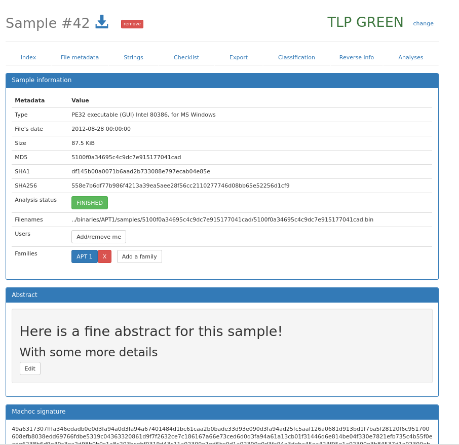
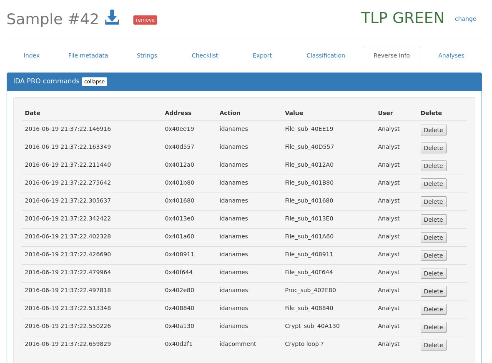
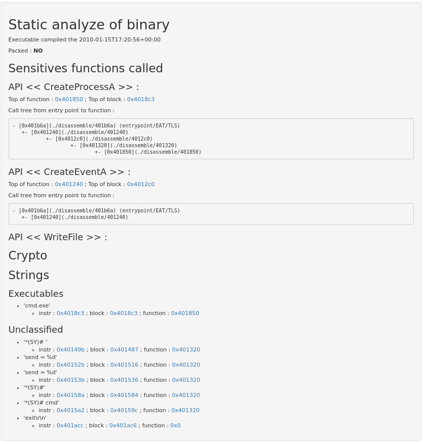

# Polichombr
Collaborative malware analysis framework

Originally presented at [SSTIC 2016] ( https://www.sstic.org/2016/presentation/demarche_d_analyse_collaborative_de_codes_malveillants/ )

# Warning
This is a beta version, use at your own risk!

# Documentation
A more detailled documentation is placed in the `docs` folder

## Analysis platform
This platform is designed to help analysts to reverse malwares, as a team.
We provide an engine to automate the analysis tasks,
and identify hotpoints in the binary, and collaboratively reverse binaries.

### Example scripts
Scripts under the folder [examples](https://github.com/ANSSI-FR/polichombr/tree/master/examples)
permits some basic actions for a Polichombr instance.

### Generic sample informations 

### Family/Threat overview

### Online disassembly

### Share IDA Pro informations from the WebUI / directly to other users

### Automated hotpoints detection 

### Plugins / tasks
Tasks are loaded from the app/controllers/tasks directory, and must inherit from the Task object.
In particular, several tasks are already implemented:
 * AnalyzeIt, a ruby script based on metasm, wich is used to identify interesting points in the binary.
   The goal is to help the analyst by giving hints about where to start. For example,
   we try to identify crypto loops, functions wich calls sensitive API (file, process, network, ...)

 * Peinfo : We load the PE metadata with the peinfo library.
 * Strings : extract ASCII and Unicode strings

### Signatures
We use several signature models to classify malware:
 * Yara
 * imphash
 * Machoc

### Machoc
Machoc is a CFG-based algorithm to classify malware.
For more informations, please refer to the following [paper] (https://www.sstic.org/media/SSTIC2016/SSTIC-actes/demarche_d_analyse_collaborative_de_codes_malveill/SSTIC2016-Article-demarche_d_analyse_collaborative_de_codes_malveillants-chevalier_le-berre_pourcelot.pdf)

## Skelenox
This is an IDAPython script, wich is used to synchronize the names and comments
with the knowledge base, and with other users database

# Installation
Please see the corresponding file in the [docs](https://github.com/ANSSI-FR/polichombr/tree/master/docs) directory

# Contributing
Contributions are welcome, so please read [CONTRIBUTING.md](https://github.com/ANSSI-FR/polichombr/blob/master/CONTRIBUTING.md)
to have a quick start on how to get help or add features in Polichombr
